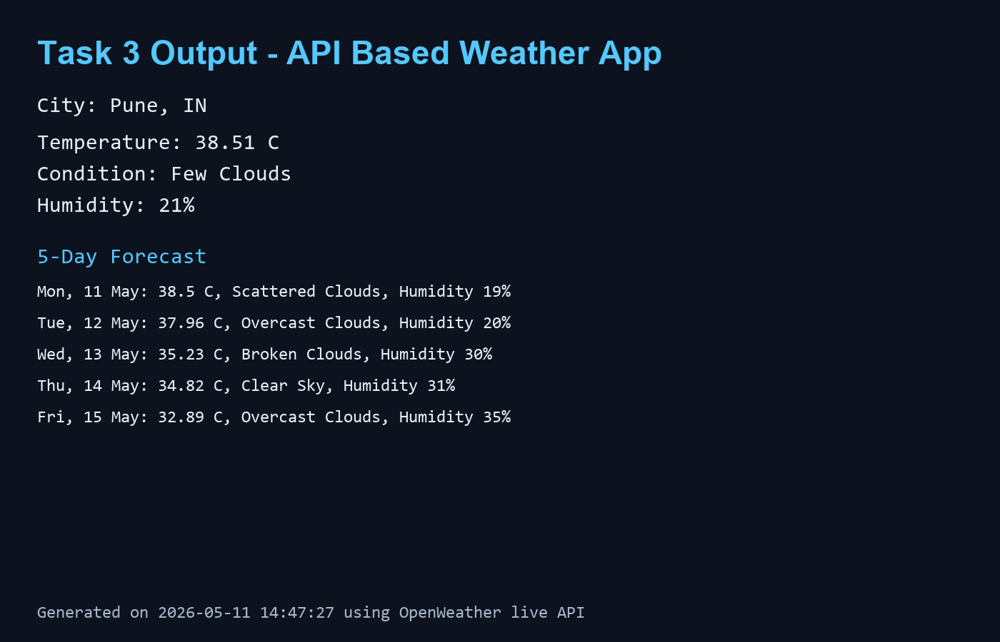

# API-Based Weather App (Python GUI)

A desktop weather app that fetches live weather data using the OpenWeather API.

## Output Screenshot


## Features
- Interactive GUI (Tkinter)
- Search weather by city name
- Shows:
  - Temperature
  - Weather condition
  - Humidity
- Handles invalid city names and API/network errors
- 5-day forecast
- Saves searched cities locally
- Saved city list with double-click search

## Requirements
- Python 3.9+
- `requests` library
- OpenWeather API key (free tier)

## Setup
1. Install dependencies:
   ```bash
   pip install -r requirements.txt
   ```
2. API key options:
   - Enter the API key directly in the app UI.
     - The app now remembers the key automatically for future launches.
   - Or set environment variable:
     - Command Prompt (`cmd`):
       ```cmd
       set OPENWEATHER_API_KEY=your_api_key_here
       ```
     - PowerShell:
       ```powershell
       $env:OPENWEATHER_API_KEY="your_api_key_here"
       ```
     - macOS/Linux:
       ```bash
       export OPENWEATHER_API_KEY="your_api_key_here"
       ```

## Run
```bash
python weather_app.py
```

## Data Storage
- Searched cities are stored in:
  - `searched_cities.json`
- Saved API key is stored in:
  - `weather_config.json`

## Notes
- Temperature is shown in Celsius (`metric` units).
- Forecast uses OpenWeather 5 day / 3 hour data and shows one daily summary line.
